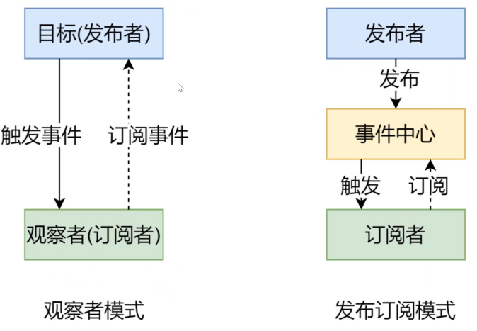
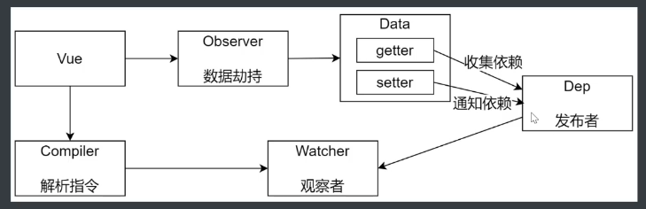
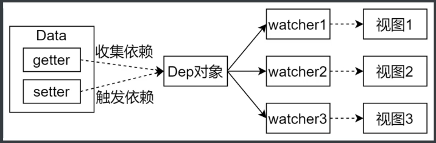
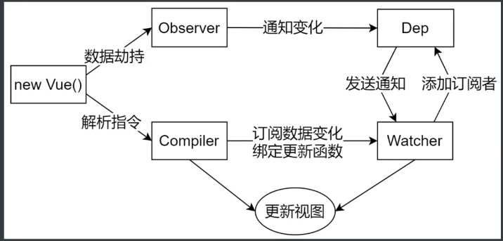

# Vue原理

## 基础结构

- data: 渲染的数据
- render: 返回虚拟dom
- $mount: 将虚拟dom渲染为真实dom并挂载到某个元素上

## 生命周期

1. `new Vue()`初始化vue实例
2. 初始化, 绑定事件和生命周期, h函数, 之后触发`beforeCreate`函数
3. 初始化, 注入和校验, 包括`proxy, data, method`等成员, `created`
4. 将模板编译成render函数, `beforeMount`
5. 创建vm.$el, 并用其替换el, `mounted`


## 语法概念

- 插值表达式, `{{}}`
- 指令, `v-if`
- 计算属性, 监听器
- class, style绑定
- 条件, 列表渲染, `v-if, v-for`
- 表单输入绑定, `v-model`
- 组件, 自定义组件
- 插槽, slot, 优化组件灵活程度
- 插件, 如`v-router`
- 混入, `mixin`
- 响应式原理
- 不同构建版本

# V-Router原理

## 基本使用

```js
// main.js
import Vue from 'vue'
import VueRouter from 'vue-router'

// 1. 注册组件, 调用传入方法, 或传入对象的install方法
Vue.use(VueRouter)
// 2. 定义路由规则
const routes = [{ path: '/', name: 'index', component: Index }, ...]
// 3. 注册router对象, 在vue实例上挂载`$route, $router`对象
new Vue({ router, render: h => h(App) }).$mount('#app')

// App.vue
<template>
  // 4. 创建路由组件的占位符, 之后会被router到的component替换掉
  <router-view/>
  // 5. 创建链接
  <router-link to="/">Index</router-link>
```

## 动态路由

```js
// router/index.js
const routes = [{
  path: '/detail/:id',
  name: 'Detail',
  props: true, // 开启将会把url中的参数传递给组件, 在组件中通过props来接收url参数
  // 路由层面懒加载, 会生成一个独立chunk(detail.[hash].js), 访问时才会加载
  component: () => import(/* webpackChunkName: "detail" */ '../views/Detail.vue'),
}]
  
// detail.vue
$route.params.id //强依赖路由
id // 开启prop, 直接绑定到component.props, 推荐方式
```

## 嵌套路由

```js
// router/index.js
const routes = [{
  path: '/', // 会和children里的path拼起来组成完整的路由路径
  component: Layout,
  children: [{
    name: 'index',
    path: '',
    component: Index,
  }, {
    name: 'detail',
    path: 'detail/:id',
    props, component, ...
  }]
}]
// Layout.vue
<template>
  <div>Common Header</div>
  <router-view/> // 会被index或detail替换
  <div>Common Footer</div>
```

## 编程式导航

push, replace, go

```js
// push到栈顶, 增加历史记录
this.$router.push({ name: 'index', params: { id: 1 }}) // 传递对象,使用name确定路由, 可传递参数
.push('/index') // 直接传递地址
// 改变栈顶, 不增加历史记录
.replace(...)
// 上下遍历历史记录栈
.go(1), .go(-1)
```

## hash和history

### hash

- url中#之后的内容作为路径地址
- 监听hashchange事件
- 根据当前路由地址找到对应组件重新渲染

### history

- 使用正常的url
- 通过`history.pushState`方法改变地址栏
  - `history.pushState()`,IE10+
  - `history.replaceState()`
  - 不会发送请求, 只会改变浏览器中的url, 并写入history
  - 在某些情况下会进行服务端请求, 如用户点击返回
- 监听popstate事件
- 根据当前路由地址找到对应组件重新渲染

#### 服务器支持

单页应用中服务端不存在类似`/login`的页面, 会返回404, 所以应该配置为**除了静态资源外全部返回单页应用的index**

#### nodejs配置

```js
const history = require('connect-history-api-fallback')
const app = express()
app.use(history()) // 未匹配时返回单页应用的首页
app.use(express.static(path.join(__dirname, '../front')))
```

#### nginx配置

```nginx
location / {
	root html;
	index index.html index.htm
  # 尝试访问uri对应文件, 对应目录下主文件, 都不匹配返回主页
	try_files	$uri	$uri/	/index.html
}
```

## 模拟实现

### 分析

```typescript
Vue.use(VueRouter) // VueRouter是方法或有install方法的类
const router = new VueRouter({ routes: [...], }) // VueRouter是个类
new Vue({ router, render: h => h(App)}).$mount('#app') // 创建实例, 注册对象
```

### 设计

| **VueRouter**                    |                                                           |
| :------------------------------- | --------------------------------------------------------- |
| +options                         | 记录构造时的配置对象                                      |
| +routeMap                        | 记录路由地址和组件的对应关系                              |
| +data                            | 有current属性, 响应式对象, 当地址发生变化时响应式更新组件 |
| +constructor(options): VueRouter | 初始化属性                                                |
| _install(Vue): void              | 静态方法, 用于实现vue的插件机制                           |
| +init(): void                    | 初始化入口, 调用下列方法                                  |
| +initEvent(): void               | 注册事件监听地址变化, 如popstate事件                      |
| +createRouteMap(): void          | 根据配置初始化routeMap属性                                |
| initComponents(Vue): void        | 创建`router-link和router-view`组件                        |

```typescript
// VueRouter.ts
let _Vue = null
export default class VueRouter {
  static installed: boolean = false
  static install(Vue): void {
    // 1. 判断当前插件是否已经安装
    if (VueRouter.installed) {
      return
    }
    VueRouter.installed = true
    
    // 2. 全局记录VueConstructor
    _Vue = Vue
    
    // 3. router对象通过prototype注入到Vue实例上
    // router对象需要从创建Vue时传入的参数得到
    // 故使用mixin.beforeCreate函数, 从中得到Vue实例
    _Vue.mixin({
      beforeCreate() {
        if (this.$options.router) {
          _Vue.prototype.$router = this.$options.router
        }
      }
    })
  }
  
  private options = {}
  private data = {}
  private routeMap = {}
  constructor(options) {
    this.options = options
    this.data = _Vue.observable({
      current: '/'
    })
    this.init()
  }
  
  private init(): void {
    this.createRouteMap()
    this.initComponents(_Vue)
    this.initEvent()
  }
  
  private createRouteMap(): void {
    this.options.routes.forEach(route => {
      this.routeMap[route.path] = route.component
    })
  }
  
  private initComponents(Vue: VueConstructor): void {
    Vue.component('router-link', {
      props: {
        to: String
      },
      // template 参数需要使用完整版的vue-cli, 开发版不带有runtimeCompiler
      // vue.config.js: { runtimeCompiler: true }
      template: '<a :href="to"><slot></slot></a>',
      
      // render(tag, props, contents)
      render: h => h('a', {
        attrs: {
          href: this.to
        },
        on: {
          click: this.clickHandler
        },
        methods: {
          clickHandler(e) {
            history.pushState({}, '', this.to)
            this.$router.data.current = this.to
            e.preventDefault()
          }
        }
      }, [this.$slots.default])
    })
    const self = this
    Vue.component('router-view', {
      render(h) {
        const component = self.routeMap[self.data.current]
        return h(component)
      }
    })
  }
  
  // 当用户前进后退时更新界面
  initEvent(): void {
    window.addEventListerner('popstate', () => {
      this.data.current = window.location.pathname
    })
  }
}
```

# Vue响应式原理

## 前置知识

### 数据驱动

- 数据响应式

  数据模型是普通JavaScript对象, 修改数据时, 视图会自动更新, 避免频繁的dom操作

- 双向绑定

  数据和视图一方改动, 另一方自动跟随改变, 使用`v-model`

- 数据驱动

  vue最核心特性, 开发过程中只需要关注数据本身, 不需要关心数据渲染到视图的过程

### 响应式核心

#### Vue2

`Object.defineProperty`, 在getter/setter中重新渲染dom, IE 9+

```js
function proxyData(data) {
  Object.keys(data).forEach(key => {
    Object.defineProperty(vue, key, {
      enumerable: true,
      configurable: true,
      get() { return data[key] },
      set(newValue) { data[key] = newValue; /* ... update dom*/ }
    })
  })
}
```

#### Vue3

使用`Proxy`直接监听对象而非属性, ES6新增, 性能由浏览器优化, IE不支持

```js
new Proxy(data, {
  get(target, key) {
    return Reflect.get(target, key)
  },
  set(target, key, value) {
    target[key] = value
    /* update dom */
    return Reflect.set(target, key, value)
  }
})
```

### 发布订阅和观察者

#### 发布订阅模式

- 发布者
- 订阅者
- 信号中心

```js
$on(eventType, handler) {
  this.subs[eventType] = this.subs[eventType] || []
  this.subs[eventType].push(handler)
}
$emit(eventType) {
  this.subs[eventType] && this.subs[eventType].forEach(h => h())
}
```

#### 观察者模式

- 目标
- 观察者
- 没有信号中心

```js
class Dep {
  constructor() { this.subs = [] }
  addSub(sub) {
    if (sub && sub.update) { this.subs.push(sub) }
  }
  notify() {
    this.subs.forEach(sub => sub.update())
  }
}
class Watcher {
  update() { /* update dom ect. */ }
}
```

#### 区别

- 观察者模式由每个具体目标调度, 订阅者和发布者具有互相依赖
- 发布订阅模式由统一的调度中心调度, 两者可以互不知道对方存在, 解除了两者之间的依赖



## 模拟实现



[代码]: 05vue原理.assets/02minivue	"mini vue"

### Vue

- 接收初始化参数
- 将data注入到vue实例中, 转换成getter/setter
- 负责调用observer监听data中所有属性的变化
- 负责调用compiler解析指令/插值表达式

### Observer

- 将data选项中的属性, 包括对象, 全部转换为响应式数据
- 发送数据对象改变的通知

### Compiler

- 负责编译模板, 解析指令和插值表达式
- 负责页面首次渲染
- 数据变化后重新渲染

### Dep(Dependency)

- 收集所有对某个属性的依赖, 添加观察者(Watcher)
- 属性变动时通知所有观察者

### Watcher

- 自身实例化时往dep对象中添加自己
- 当dep通知时更新视图, 更新视图方法通过外部传入
- y因为需要更新方法, 故在compiler渲染插值表达式, 指令时, 为每一处属性创建watcher





### 问题

- 将属性重新赋值为对象, 是否是响应式的: 是
- 给Vue实例增加成员, 是否是响应式的: 否

# virtual dom原理

用普通js对象描述dom对象, dom属性特别多, 而js只需要少量几个属性, 所以**创建开销小**

## 为什么使用vDOM

- 手动操作dom麻烦, 需要考虑兼容性, 随着项目复杂, dom的操作复杂度提升
- MVVM框架解决了视图和状态的同步问题
- 使用模板引擎可以简化视图操作, 但不能解决状态同步
- VDOM好处是状态变化时不需要立即更新DOM, 只需要一个VDOM tree来描述dom, VDOM内部进行diff和局部更新
  - VDOM维护程序状态, 跟踪上一次的状态
  - 更新时, 通过比较前后两次状态差异来更新真实的dom

### 作用

- 维护视图和状态的关系
- 复杂视图下提升渲染性能
- 方便兼容SSR, 原生应用, 小程序等

## snabbdom

```js
// snabbdom没有默认导出, 只能使用大括号
import { init, h, thunk } from 'snabbdom'
// init返回patch()
const patch = init([])
// h返回虚拟节点vnode
const newVnode = h('div#container', [
  h('h1', 'hello'),
  h('h2', 'world')
])

const dom = document.querySelector('#app')
// patch(dom|vnode, vnode): updatedVnode
const oldVnode = patch(app, vnode)
// 清空节点, 不能穿传null, 传入注释节点
patch(oldVnode, h('!'))

// thunk是优化策略, 处理不变数据时使用
```

### 模块

snabbdom提供6个核心模块

- attributes
  - 设置dom元素属性, 底层使用`setAttribute`
  - 可以处理boolean属性
- props
  - 和attributes类似, 用于设置dom属性 `element[attr] = value`
  - 不处理Boolean属性
- class
  - 切换类样式
  - 设置类样式, 通过sel选择器
- dataset
  - 设置data-*自定义属性
- eventlisteners
  - 注册移除事件
- style
  - 设置行内样式, 支持动画
  - delayed/destroy/remove

#### 使用

导入模块; init中注册模块; h创建vnode时, 在第二个参数中传递

```js
// 最新版本snabbdom使用package.json:exports关键字导出模块, 但尚未被广泛支持
// 需要自己找到对应路径
import { init } from 'snabbdom/build/package/init'
import { classModule } from 'snabbdom/build/package/modules/class'
import { propsModule } from 'snabbdom/build/package/modules/props'
import { styleModule } from 'snabbdom/build/package/modules/style'
import { eventListenersModule } from 'snabbdom/build/package/modules/eventlisteners'
import { h } from 'snabbdom/build/package/h'

const patch = init([
  classModule,
  propsModule,
  styleModule,
  eventListenersModule
])

const vnode = h('div', {
  style: { backgroundColor: 'red' },
  on: { click: () => alert('!') }
}, [h('h1', 'hello'), h('h2', 'world')])

const app = document.querySelector('#app')
patch(app, vnode)
```

### snabbdom源码学习

- 先宏观了解
- 带着目的看源码, 如vnode是如何渲染的
- 过程不求甚解, 只走主线
- 调试
- 参考资料

#### 核心流程

1. 使用h创建vnode描述dom
2. init设置模块, 创建patch函数
3. patch比较两个node
4. 将变化内容更新到dom上

最主要是`h, snabbdom, vnode`三个文件

### h函数

```js
function h(sel: string, data?: VNodeData, children?: VNodeChildren)
// 函数重载, 将函数参数规范化为上述类型
// 需要把children中的基本类型参数都转化为vnode
// 若selector中带有svg命名空间, 还需要设置data.ns
// 最终返回一个vnode
```

### vnode

```typescript
interface VNode {
  // 选择器
  sel?: string
  // 节点数据, 如属性, 样式等
  data?: VNodeData
  // 记录 vnode 对应的真实dom
  elm?: Node
  // 子节点, 和test互斥
  children?: Array<VNode | string>
  // 节点中文字内容, 和data互斥
  text?: string
  // 数组渲染时优化用
  key?: string | number
}
interface VNodeData {
  props?: Props
  attrs?: Attrs
  class?: Classes
  style?: VNodeStyle
  dataset?: Dataset
  on?: On
  hero?: Hero
  attachData?: AttachData
  hook?: Hooks
  key?: Key
  ns?: string // for SVGs
  fn?: () => VNode // for thunks
  args?: any[] // for thunks
  [key: string]: any // for any other 3rd party module
}
```

### init

`init(modules: Array<Partial<Module>>, domApi: DOMAPI): patch`

1. 初始化DOMapi, 默认使用HTML标准dom操作api
2. 将传入modules中的各个阶段的钩子函数统一存储到一个对象中, 方便之后调用
3. 创建并返回patch函数

### patch

`patch(oldVnode/dom, newVnode): newVnode`

- 对比新旧节点是否相同, key和sel
- 不相同, 则删除之前节点, 重新渲染
- 相同节点, 则判断新Vnode是否有text, 有且不同, 则直接更新
  - 新节点有children, 通过diff判断子节点是否变化 并更新
  - diff只进行同层级比较

0. 创建`insertedVnodeQueue`数组, 用于存储已创建但未插入到dom中的vnode, 用于insert钩子函数的调用
1. 触发`pre`钩子函数
2. 将oldNode规范化为vnode
   1. 若oldNode不是Vnode(.sel !== undefined), 通过`emptyNodeAt`函数转化为vnode
   2. 获取dom标签, class, id
   3. 构建selector, 通过`sel, elm`构建vnode
3. 判断old和new是否是相同节点( `key, sel`都相同), 相同直接`patchVnode`
4. 否则插入newNode到oldVnode位置
   0. 获取oldVnode的parentDOM
   1. `createElm`创建新dom
   2. `insertBefore(parent, newVnode.elm, nextSibling(oldNode.elm)`
   3. `removeVnode(parent, [oldVnode], 0, 0)`
5. 调用所有`insertedVnodeQueue`中node的insert钩子函数
6. 触发`post`钩子函数

#### createElm

1. 触发vnode的`init`钩子函数
2. 将vnode转化为dom对象(并不渲染到页面)
   1. `sel === '!'`创建注释节点`createComment`
   2. `sel === undefined`创建文本节点`createTextNode`
3. sel不为空, 创建普通节点
   1. 解析选择器, 获取tag, class, id
   2. `createElement(NS)`(根据data.ns判断), 创建element, 并设置id, class
   3. 触发模块的`create`钩子函数
   4. 追加children或者text
      1. 将`children`中的vnode递归调用`createElm`创建dom, 并`appendChild`到当前节点
      2. `appendChild(vnode.elm, createTextNode(vnode.text)`
   5. 触发node的create钩子函数
   6. 若node有insert钩子函数, 将node放入`insertedVnodeQueue`队列中, 方便后续调用回调

#### removeVnodes

`removeVnodes(parentElm: Node, vnodes: Vnode[], startIndes, endIndex): void`

1. 遍历vnode
   1. sel为空时是文本节点, 直接调用`removeChild(parentElm, child.elm)`
2. `invokeDestroyHook`执行当前节点, 以及所有子节点的destroy钩子函数
   1. 执行用户的destroy回调函数
   2. 遍历children并对普通子节点迭代调用`invokeDestroyHook`
3. `createRmCb(child.elm, cbs.remove.length + 1)`创建删除节点函数`rm`
   1. 每次调用`--length`, 防止之后重复调用移除函数
4. 遍历并调用模块的`remove`钩子函数`cbs.remove[i](child, em)`
5. 执行`vnode.data.hook.remove`钩子函数, 或之前创建的`rm`函数 删除节点

#### addVnodes

`addVnodes(parentElm, before, vnodes, startIndex, endIndex, insertedVnodeQueue)`

将`vnodes[startIndex, endIndex]`中的vnode插入到parentElm.before之前

`insertBefore(parentElm, createElm(child, insertedVnodeQueue), before)`

#### patchVnode

1. 触发用户定义prepatch钩子函数
2. `new.elm = old.elm`, 如果新旧节点相同, 直接返回
3. 触发update钩子函数, 先执行模块update, 再执行用户update
4. update
   1. `newVnode.text && newVnode.text !== oldVnode.text`
      1. `removeVnodes(elm, oldCh, 0, oldCh.length - 1)`
      2. `setTextContent(elm, vnode.text)`
   2. `old.children && new.children && old.children !== new.children`
      1. `updateChildren`, 对比子节点并更新
   3. `new.children && !old.children`
      1. `setTextContent(elm, '')`
      2. `addVnodes(elm, null, children, 0, children.length - 1, inQueue)`
   4. `!new.children && old.children`
      1. `removeVnodes(elm, oldCh, 0, oldCh.length - 1)`
   5. `!new.text && old.text`
      1. `setTextContent(elm, '')`
5. 触发postpatch钩子函数

#### updateChildren

- **找到两棵任意的树之间最小修改的时间复杂度是O(n^3)**, n^2用于两层遍历寻找需要更新的节点, n用于更新节点
- 极少发生跨层级的childNode update, 故只进行同级别的子节点间比较
- 同级别节点比较, 会对新旧的开始和结尾设置索引, 并且只比较新旧两个索引下的node
- 若比较的两个node相同, 则调用patchNode更新oldNode到newNode
  - 比较更新后会更新索引, start++, end--
  - oldStart/newStart, oldEnd/newEnd
  - oldStart/newEnd
    - 把oldStartNode移动到oldEndIndex之后
  - oldEnd/newStart
    - 把oldEndNode移动到newStartIndex之前
- 若四种情况都不满足, 需要遍历oldStart-oldEnd, 寻找与newStartNode相同key的节点
  - 若找到了
    - oldNode.sel !== newNode.sel, 节点被更新, 需要重新创建对应的dom
    - 将oldNode移动到oldStartIndex之前

以上不断循环, 直到

- 老节点先遍历完成(oldStart > oldEnd), 循环结束
  - 将剩余新节点移动到newEndIndex之后
  - `addVnodes(parent, newCh[newIndex+1]?.elm, newCh, newStartIndex, newEndIndex, insertQueue)`
- 新节点先遍历完成(newStart > newEnd), 循环结束
  - 将剩余老节点删除
  - `removeVnodes(parent, oldCh, oldStart, oldEnd)`

### modules

将处理元素属性/事件/样式等放置到模块中, 按需导入, 精简核心库

在init.ts初始化中, 将所有使用到的modules中的所有钩子函数, 都放置在`cbs`数组中, 用于之后触发调用

#### hooks.ts

```js
// src/hooks.ts
...
// createElm函数末尾调用, 创建完真实dom后触发
// 可用于applystyle, addLisener等等
create?: CreateHook;
// patchVnode函数开头调用, 在prepatch之后调用
// 在vnode更新过程中调用, 在vnode.elm更新之后, children更新之前触发
update: UpdateHook
```

#### attributes.ts

`function updateAttrs(oldVnode: VNode, vnode: VNode): void`

- 遍历新节点并赋值
  - boolean value
    - elm.setAttribute(key, '') , elm.removeAttribute(key)
  - x开头属性, 命名空间属性, 直接`elm.setAttribute`
  - xml属性, (`charCodeAt(3) === ':'`), `elm.setAttributeNS(xlinkNS, key, cur)`
  - 普通属性, `elm.setAttribute`
- 遍历旧节点属性, 删掉未出现在新节点中的属性


# 附录